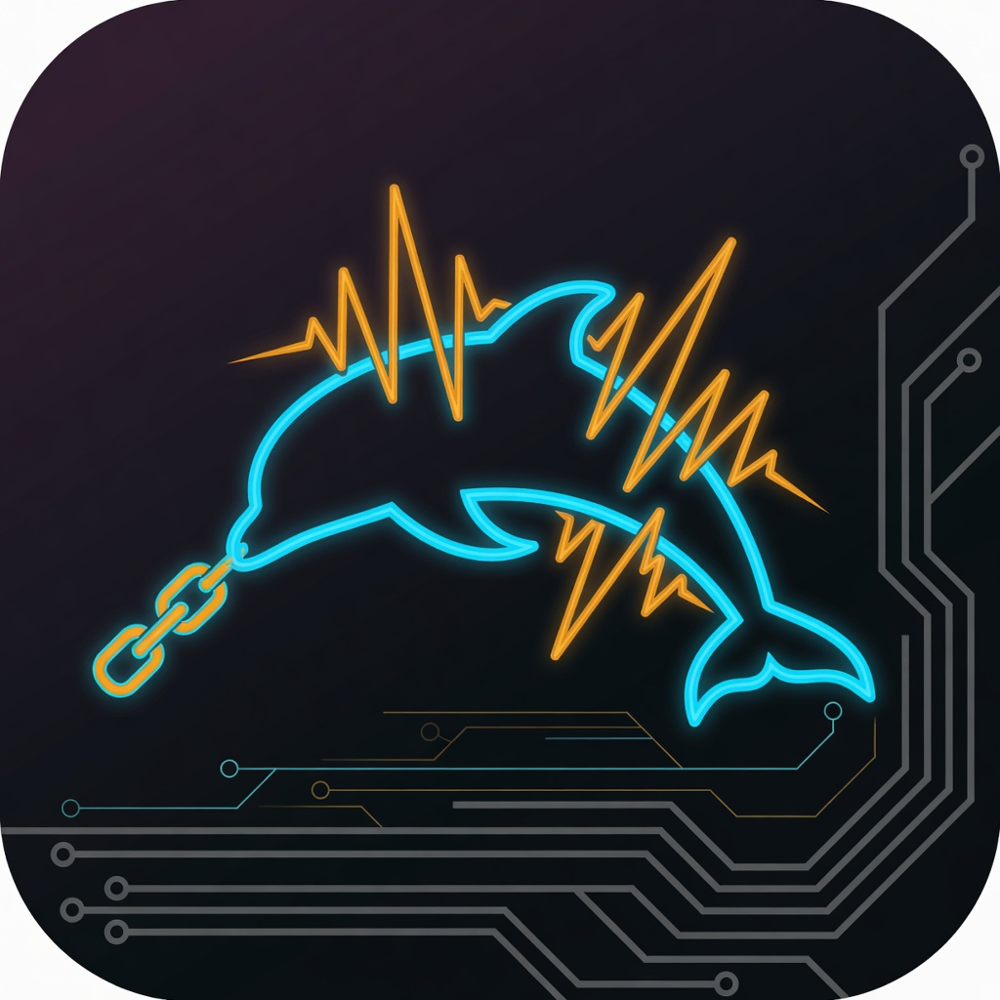
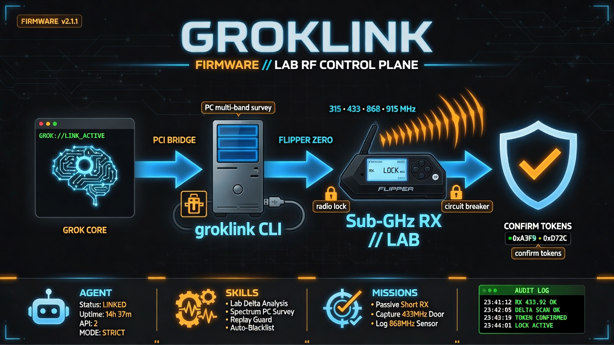

# GrokLink Firmware v2.1.3

<p align="center">
  
</p>

**Custom Flipper Zero firmware overlay + PC bridge for authorized, educational hardware research - with a local autonomy agent and AI-assisted skill crafting.**

> **Looking for the from-scratch OS?**  
> **[GrokLink OS 3.0 (GrokLink Native)](https://github.com/Pitchfork-and-Torch/GrokLink-OS)** is a clean-room research RTOS (kernel, drivers, agent, RPC, PC bridge) — not an overlay on Flipper firmware.  
> This repo remains the **v2.x Flipper overlay** path.

<p align="center">
  
</p>

[](LICENSE)
[](https://github.com/Pitchfork-and-Torch/GrokLink-Firmware/releases)
[](https://github.com/Pitchfork-and-Torch/GrokLink-OS)

> **LEGAL / ETHICAL WARNING**  
> GrokLink is for **authorized research, education, and your own equipment only**.  
> Unauthorized access to RF/IR/RFID/NFC systems, vehicles, access control, or third-party devices may be a crime.  
> The authors and distributors accept **no liability** for misuse.  
> All RF TX, GPIO drive, and invasive actions require **explicit confirmation** and are subject to **blacklists + audit logs**.

<p align="center">
  
</p>

### First deployment and leisure explore (signals characterization)

See **[docs/FIRST_DEPLOYMENT_REPORT.md](docs/FIRST_DEPLOYMENT_REPORT.md)** and **[docs/FULL_EXPLORE_REPORT.md](docs/FULL_EXPLORE_REPORT.md)** - passive multi-band survey, 433.92 MHz activity, site-specific 300 MHz density, TX gate checks, and skills such as `sigint_433_activity_watch` and `lab_band_survey_leisure`.

### Docs index

- [Architecture](docs/ARCHITECTURE.md)
- [Safety](docs/SAFETY.md)
- [Build and flash](docs/BUILD_FLASH.md)
- [Explore notes](docs/EXPLORE_NOTES.md)
- [Agent skills (PC)](docs/AGENT_SKILLS.md)
- [Skill tracking (on-device)](skills/TRACKING.md)
- [Full explore report](docs/FULL_EXPLORE_REPORT.md)
- [v2.0 release notes](docs/V2_RELEASE_NOTES.md)
- [Async radio design](docs/ASYNC_RADIO_DESIGN.md)
- [Private vault](docs/PRIVATE_VAULT.md)
- [Skill-router mirror](docs/SKILL_ROUTER_MIRROR.md)
- [BLE status channel plan](docs/BLE_STATUS_CHANNEL.md)
- [What we learned](docs/WHAT_WE_LEARNED.md)
- [Healthcare / MedSec plan](docs/HEALTHCARE_MEDSEC_PLAN.md) (research only; not a medical device)
- [Healthcare operator runbook](docs/HEALTHCARE_OPERATOR_RUNBOOK.md)
- [Field report v2.1.3](docs/FIELD_REPORT_V2.1.3.md) (new tools + breaker lab verify)

---

## What is GrokLink?

GrokLink Firmware (this repo) is **not** a from-scratch OS. It is a **structured fork overlay** on [official Flipper Zero firmware](https://github.com/flipperdevices/flipperzero-firmware) that adds:

For the native OS rewrite (custom RTOS + HAL, no Flipper overlay), see **[GrokLink-OS](https://github.com/Pitchfork-and-Torch/GrokLink-OS)**.

| Layer | Role |
|-------|------|
| **GrokAgent** | Persistent on-device service: missions, decisions, logging, offline autonomy |
| **GrokRPC** | Extended protobuf RPC over USB/BLE exposing hardware under safety gates |
| **Skill host** | Load skill modules (config + optional FAP) from SD card |
| **PC bridge** | Python tool: terminal Grok / scripts get full gated hardware control + streams |
| **Skill craft** | Analyze captures -> generate skill stubs -> deploy to SD (human-approved) |

### Hardware reality (STM32WB55)

| Resource | Typical budget for GrokLink additions |
|----------|----------------------------------------|
| Flash (app image) | Keep agent + RPC extras **< ~80-120 KB** |
| RAM | Agent heap target **< 12 KB** static + small mission buffers |
| Storage | Missions, skills, logs on **SD card** (not internal flash) |
| Compute | **No on-device LLM**. Decision engine = rules + timers + thresholds. ML is PC-side / future tiny models |

**Feasible design principle:** Flipper runs *sensors + actuators + scheduler*; Grok (PC/cloud) runs *reasoning + skill generation*.

---

## Architecture (text diagram)

```
+------------------------------------------------------------------+
|                     PC / Terminal Grok                           |
|  bridge/groklink  -- skill craft -- missions -- stream consumer  |
+--------------------------------+---------------------------------+
                                 |
                    USB CDC / BLE (GrokRPC)
                                 v
+------------------------------------------------------------------+
|              Flipper Zero -- GrokLink Firmware                   |
|  +------------+  +-------------+  +---------------------------+  |
|  | Safety     |  | GrokRPC     |  | GrokAgent (service)       |  |
|  | interlocks |<-| handlers    |<-| mission queue/scheduler  |  |
|  | blacklist  |  | stream      |  | decision rules/audit log  |  |
|  | confirm    |  | session     |  | skill loader (SD)         |  |
|  +-----+------+  +------+------+  +-------------+-------------+  |
|        |                |                       |                |
|        v                v                       v                |
|  SubGHz / RFID / NFC / IR / GPIO / iButton / UART / SPI / BT     |
|                    (official Flipper HAL)                        |
|  +------------------------------------------------------------+  |
|  | SD: /ext/groklink/{missions,skills,logs,config,blacklist}  |  |
|  |     /ext/apps/GrokLink/*.fap  (dynamic skills)             |  |
|  +------------------------------------------------------------+  |
+------------------------------------------------------------------+
```

### Learning loop (skill craft)

1. **Capture** - mission or interactive session logs raw events to SD (`logs/*.jsonl`).
2. **Transfer** - bridge pulls logs over GrokRPC or mass-storage.
3. **Analyze** - PC Grok / scripts classify signals, gaps, repeat patterns.
4. **Generate** - skill craft emits skill manifest + optional FAP template / protocol decoder stub.
5. **Human approve** - operator reviews; no auto-flash of unsigned invasive skills.
6. **Deploy** - write skill to SD; GrokAgent reloads skill index; optional FAP build via ufbt.
7. **Mission** - offline mission uses new skill under safety policy.

---

## Repo structure

```
GrokLink-Firmware/
  README.md                 # This file
  LICENSE                   # MIT + safety notice
  SECURITY.md
  docs/
    ARCHITECTURE.md
    SAFETY.md
    BUILD_FLASH.md
    GROKRPC.md
    MISSIONS.md
    EXTENSIBILITY_ML.md
    FIRST_DEPLOYMENT_REPORT.md
    EXPLORE_NOTES.md
  firmware/                 # Overlay onto flipperzero-firmware
    applications/services/grok_agent/
    applications/system/grok_rpc/
    applications/main/groklink_cli/
    lib/groklink/
    applications_user/      # Optional user FAPs
  schemas/
    groklink.proto
  sd_card/groklink/         # Preseed SD layout
  bridge/                   # Python PC bridge
    groklink/
  skills/                   # Templates + examples
  tools/                    # Patch/apply overlay scripts
  examples/
  assets/                   # Logo and infographics
```

---

## Quick start

### 1) Firmware (Momentum / Flipper firmware tree)

```powershell
# Apply overlay into a local Momentum (or official) firmware checkout, then build
.\tools\apply_overlay.ps1 -FirmwareRoot "C:\path\to\flipper-firmware"
cd C:\path\to\flipper-firmware
.\fbt.cmd COMPACT=1 DEBUG=0
# Flash via qFlipper using dist\f7-C\*.dfu  (or: .\fbt.cmd flash_usb_full)
```

Release builds attach a prebuilt `.dfu` for qFlipper (latest: **v2.1.3** / `GrokLink-v2.1.3.dfu`). Prefer building from source when possible.

See [docs/BUILD_FLASH.md](docs/BUILD_FLASH.md) and [docs/INTEGRATION_STATUS.md](docs/INTEGRATION_STATUS.md).

### 2) SD card

Copy `sd_card/groklink/` -> Flipper SD `/ext/groklink/`.

### 3) PC bridge

```powershell
cd bridge
py -3 -m pip install -e .
$env:GROKLINK_PORT = "auto"       # or COM5 / sim
$env:GROKLINK_TRANSPORT = "cli"   # Flipper VCP; use sim offline
py -3 -m groklink.cli connect
py -3 -m groklink.cli status
py -3 -m groklink.cli mission list
py -3 -m groklink.cli hw subghz-rx --freq 433920000 --ms 5000
```

### 4) Terminal Grok usage

```text
# Tool-call the groklink CLI; never bypass confirms for TX.
"Connect to Flipper, show status, passive 433.92 MHz listen 5s.
 Only TX if I explicitly authorize a owned target."
```

`py -3 -m groklink.cli grok-prompt` prints the system rules.

See [examples/](examples/) and [docs/MISSIONS.md](docs/MISSIONS.md).

---

## Safety summary

- **Default deny** for TX and GPIO output.
- **Confirm tokens** required for elevated actions (local UI or PC `--confirm`).
- **Frequency / protocol blacklists** on SD (edit only offline with intent).
- **Append-only audit log** with hashes for mission steps.
- **Educational mode** watermark on logs.
- See [docs/SAFETY.md](docs/SAFETY.md).

### Healthcare / MedSec (research only)

GrokLink is **not a medical device** and is **not** for diagnosis, treatment, or patient-connected care.
Phase 1 packs (passive MedSec / facility RF / owned-asset NFC study) live under
`sd_card/groklink/healthcare/` with plan and runbook in `docs/HEALTHCARE_*.md`.
Phase 2 PC tools: `groklink lab engagement-init`, `stamp-audit`, `export-csv`,
`export-json`, `export-fhir` (research-shaped only), `anomaly` (never auto-TX).

---

## Version

| Field | Value |
|-------|-------|
| Product | GrokLink Firmware |
| Version | 2.1.3 |
| Base | Flipper / Momentum firmware (pin a known tag when building) |
| Agent API | groklink RPC API 2 |
| Bridge | 2.1.3 |

---

## Support the work

GrokLink is **free and open source**. Bug reports and feature requests are welcome via [GitHub Issues](https://github.com/Pitchfork-and-Torch/GrokLink-Firmware/issues).

---

## Extensibility

On-device ML is intentionally out of scope for current releases (RAM/Flash). See [docs/EXTENSIBILITY_ML.md](docs/EXTENSIBILITY_ML.md) for a path toward tiny inference, feature extractors, and PC-side model training.

---

*GrokLink - intelligent controller, constrained hardware, human in the loop.*
